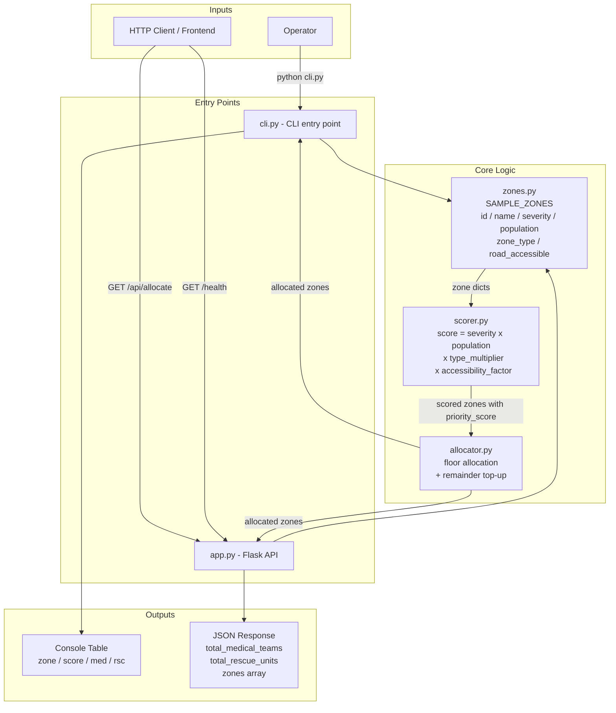

# Architecture

## System Architecture



### Scoring formula

```
priority_score = severity × population × type_multiplier × accessibility_factor

  zone_type     type_multiplier
  ----------    ---------------
  earthquake         1.5
  flood              1.3
  fire               1.2
  other              1.0

  road_accessible    accessibility_factor
  ---------------    --------------------
  True                     1.0
  False                    0.8
```

### Allocation formula

```
per_zone = floor( zone_score / total_score × total_units )

Remainder = total_units - sum(per_zone)
→ awarded 1 unit at a time to the highest-scoring zones
→ guarantees sum(allocated) == total_units exactly
```

## Components

| Component | File | Technology | Inputs | Outputs | Responsibility |
|---|---|---|---|---|---|
| Zone Data | `zones.py` | Python 3.9+ | — | `SAMPLE_ZONES` list of dicts | Holds all hardcoded disaster zone records (id, name, severity, population, zone_type, road_accessible) |
| Scoring Engine | `scorer.py` | Python 3.9+ | Zone dicts from `zones.py` | Zone dicts enriched with `priority_score` | Calculates `severity × population × type_multiplier × accessibility_factor` for each zone |
| Allocator | `allocator.py` | Python 3.9+ (stdlib `math`) | Scored zone dicts + total resource counts | Zone dicts with `medical_teams_allocated` and `rescue_units_allocated` | Distributes resource pools proportionally using floor allocation with remainder top-up |
| REST API | `app.py` | Flask | HTTP `GET /api/allocate` request | JSON body with zones, scores, and allocations | Orchestrates the score → allocate pipeline and serves results over HTTP; also exposes `GET /health` |
| CLI | `cli.py` | Python 3.9+ | Environment variables for resource totals | Formatted console table | Runs the full pipeline and prints a columnar allocation summary to stdout; no Flask dependency |
| Config | `.env.example` | Environment variables | — | `TOTAL_MEDICAL_TEAMS`, `TOTAL_RESCUE_UNITS`, `APP_PORT` | Documents all tuneable runtime parameters; copy to `.env` to override defaults |

## Data Flow

1. Zone records are loaded from `zones.py` (`SAMPLE_ZONES` list).
2. `scorer.py` computes `priority_score = severity × population × type_multiplier × accessibility_factor` for each zone.
3. `allocator.py` divides the total resource pool proportionally across zones using floor allocation; remainder units go to the highest-scoring zones.
4. **CLI path:** results are formatted and printed as a columnar table.
5. **API path:** results are serialised to JSON and returned by the Flask `/api/allocate` route.

## Scoring Formula Detail

```
priority_score = severity × population × type_multiplier × accessibility_factor

type_multiplier:
  earthquake → 1.5
  flood      → 1.3
  fire       → 1.2
  other      → 1.0

accessibility_factor:
  road_accessible = True  → 1.0
  road_accessible = False → 0.8
```

## Security Considerations

- Resource totals are read from environment variables — never hardcoded credentials.
- No database, no auth tokens, no external network calls in this prototype.
- `.env` is listed in `.gitignore` and never committed.

## Scalability Notes

The Flask backend is stateless. The scoring and allocation modules are pure functions with no shared state, making them trivially thread-safe. For production scale, the zone data source could be replaced with a database or real-time feed by swapping out `zones.py` without touching the scorer or allocator.
